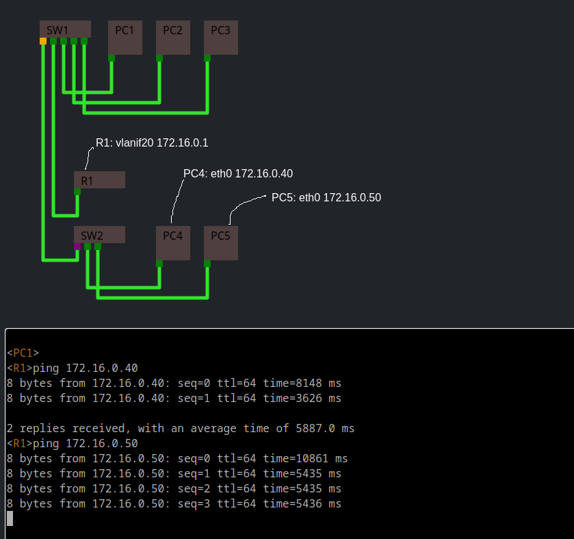

#   Unsmart Net-Tools

An attempt at implementing the TCP/IP stack within a browser context.

## Tasks

- Device
  - [ ] add teardown method for `BaseInterface`
  - [ ] spawned programs able to return values to parent
  - [x] device: key value database
  - [ ] IPC, create a way for processes to send messages between each other
  - [ ] Investigate improving the device scheduler
  - programs
    - [ ] UDP/DNS server and client
    - [ ] routeinfo
      - [ ] add a route
        - [x] add an ipv4 route
      - [x] remove a route
  - [ ] Device -> contact
    - [x] UDP protocol support
    - [x] TCP protocol support*
- [ ] Terminal & Shell
  - [ ] batch rendering for more efficient rendering
  - [x] `TerminalRenderer` make rendering faster
  - [ ] *Auto resize `TerminaleRenderer` View* haven't decided on what this means
  - [ ] Enviroment Variables & Variable expansion `Shell.promptBuffer`
  - [ ] When a progam is selected the lazy writer call a method on the function to reccomend text
- [ ] visualize `Struct`
- [x] Remove `Buffer` from client build
- [ ] Logically separate the code
  - [x] Seperate Address class from struct-type

