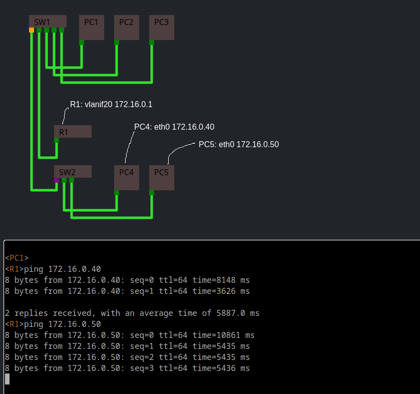

#   Unsmart Net-Tools

An attempt at implementing the TCP/IP stack within a browser context.

## Tasks

- **`Device`**
  - [ ] add teardown method for `BaseInterface`
  - [x] device: key value database
  - [ ] IPC, create a way for processes to send messages between each other
  - [ ] Investigate improving the device scheduler
  - programs
    - [ ] UDP/DNS server and client
    - [ ] routeinfo
      - [ ] add a route
        - [x] add an ipv4 route
      - [x] remove a route
  - [ ] Device -> contact
    - [x] UDP protocol support
    - [x] TCP protocol support*
- [ ] Terminal & Shell
  - [x] batch rendering for more efficient rendering
    - [ ] `TerminalRenderer` batch paints, i.e. requestAnimation frame for draw calls ...
  - [x] `TerminalRenderer` make rendering faster
  - [ ] Enviroment Variables & Variable expansion `Shell.promptBuffer`
- `ProgramParameter`
  - [ ] `ProgramParameter`.guess or something where it takes an input value and returns possible values.
- [x] visualize `Struct`
- [x] Remove `Buffer` from client build
- [ ] Logically separate the code
  - [x] Seperate Address class from struct-type

